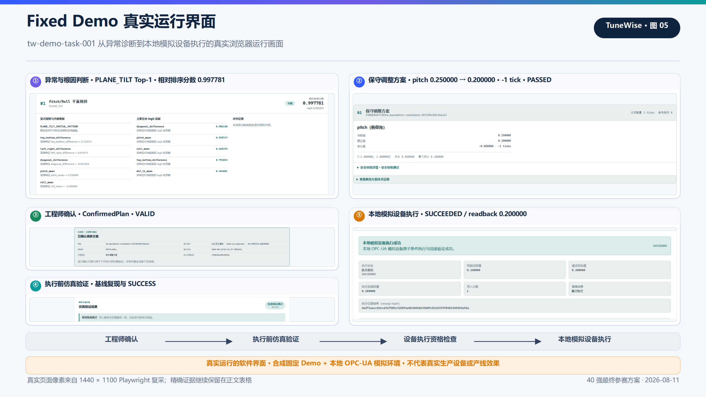
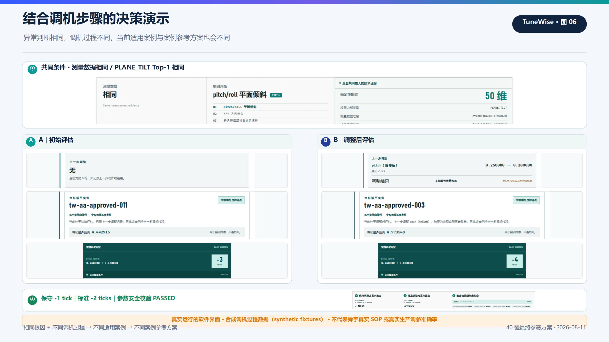
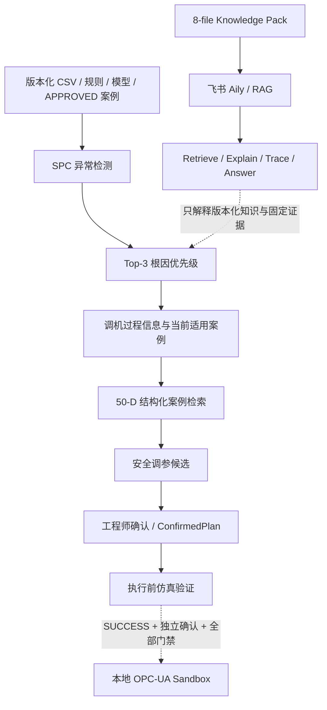

# TuneWise

## AA 工站 AI 调机决策支持

*Human-in-the-loop AI tuning decision support for precision optical Active Alignment workflows*

TuneWise 是面向精密光学 Active Alignment（AA）工站的 Human-in-the-loop AI 调机决策支持原型：AI 分析异常、给出根因优先级和安全调参候选，工程师确认后先进行执行前仿真验证，并可在本地 OPC-UA Sandbox 中验证受控执行链。

当前仓库提供可直接运行的本地软件原型、Fixed End-to-End Demo、独立的 Process-aware Decision Demo，以及已发布的飞书 Aily 工程解释应用。AI 负责分析、检索和候选证据；AA 工艺工程师负责选择、确认与执行授权。当前演示数据仍为 synthetic，设备通道仍为本地 sandbox，尚未完成授权真实 AA 设备数据验证。

**快速入口：** [快速启动](#快速启动) · [5 分钟演示脚本](docs/submission/demo-script-5min.md) · [评委快速体验指南](docs/submission/judge-guide.md) · [完整文档索引](docs/README.md)

### Fixed Demo



> **Fixed Demo：异常诊断 → 调参候选 → 工程师确认 → 执行前仿真验证 → 本地模拟设备执行。** 画面来自当前软件真实运行记录；数据为 **synthetic fixed dataset**，设备为 **LOCAL OPC-UA SANDBOX**，不代表真实产线或真实设备效果。

### Process-aware Demo



> **相同测量与根因证据 + 不同调机过程信息 → 不同当前适用案例 → 不同案例参考方案。** 画面来自当前软件真实 A/B 运行记录；输入为 **synthetic process-context demonstration**，不代表舜宇真实 SOP、生产数据或真实推荐准确率。

## 当前证据边界

- Fixed Demo 使用 **synthetic fixed dataset**；Process-aware Demo 使用 **synthetic process-context fixtures**。
- 当前 OPC-UA 通道仅连接固定 loopback 的 **LOCAL sandbox**，未接入真实 PLC、AA 设备、MES 或 QMS。
- `0.997781` 是用于当前候选根因排序的 **relative ranking score**，不是 99.7781% 故障概率、校准置信度或真实发生率。
- 执行前仿真验证 `SUCCESS` 只表示固定 simulator、场景、扰动、seed 和评价规则下满足预设条件，不等于真实产线效果、良率改善、因果有效或参数最优。
- 尚未完成授权真实 AA 设备数据、真实设备安全联锁或真实生产结果验证。
- 飞书 Aily 只做 Retrieve / Explain / Trace / Answer；不生成新参数、不触发仿真、不修改 `ConfirmedPlan`、不执行 `DeviceExecution`、不写 OPC-UA。
- LOROS 是采用 `CC-BY-4.0` 的真实公开光学实验数据，包含 MTF、SFR 与 processed ROI；但缺少 AA device pose、tuning action、root-cause ground truth、before/after intervention 与 production outcome。
- LOROS 接入结论为 **NO-GO / semantic mismatch**。项目没有为了“真实数据验证”伪造、复制或重命名缺失字段。

## 核心能力

1. **可解释根因优先级**：SPC + engineering features + 固定 `StandardScaler` + multinomial Logistic Regression；展示 Top-3、规则和 logit 贡献。模型输出是 relative ranking score，不是 probability。
2. **调机过程信息**：当前阶段、上一步调整与调整结果决定哪些历史案例当前适用；Process Context 不进入 classifier，也不改变 `StandardScaler` 或 Root Cause Top-3。
3. **历史参考案例**：只检索兼容的 `APPROVED` 案例，使用 50-D structured retrieval，并绑定版本、来源与证据哈希。
4. **安全调参候选**：生成保守调整方案、标准调整方案和案例参考方案；三类候选统一通过 `ParameterSafetyValidator`。
5. **工程师确认**：服务端从已验证候选生成不可变 `ConfirmedPlan`，绑定身份、时间、版本和哈希，并阻断 stale 或 tampered 方案。
6. **执行前仿真验证**：先复现导入基线，再在固定模拟条件下运行调参方案，并按确定性评价规则输出结构化结果。
7. **本地 OPC-UA Sandbox**：通过受控 Method 执行 expected-before、单参数写入、readback 与 idempotency；`UNKNOWN_OUTCOME` 只允许只读 reconciliation。
8. **飞书 Aily 工程解释**：8-file Knowledge Pack + RAG，支持 Retrieve / Explain / Trace / Answer，与参数和设备控制链隔离。

## Demo A — Fixed End-to-End Demo

运行入口：<http://127.0.0.1:8000/>

| 固定证据 | 当前结果 |
| --- | --- |
| Task | `tw-demo-task-001` |
| Top-1 | `PLANE_TILT` |
| Relative ranking score | `0.997781` |
| 工程师选择 | `pitch 0.250000 → 0.200000` |
| 候选类型 | 保守调整方案，`-1 tick`，`PASSED` |
| Simulation Validation | `SUCCESS`；baseline reproduction `PASSED` |
| Local Sandbox Execution | `SUCCEEDED` |
| Readback | `0.200000` |

这些结果证明当前固定软件链和本地 sandbox 可以按版本化证据运行，不证明生产效果、真实根因、真实设备安全或良率提升。完整点击路径见[评委快速体验指南](docs/submission/judge-guide.md)。

## Demo B — 结合调机步骤的决策演示

运行入口：<http://127.0.0.1:8000/process-aware-demo/>

```text
Same measurement / root-cause evidence
               +
Different process context
               ↓
Different eligible cases
               ↓
Different CASE_GUIDED
```

| 场景 | 当前调机过程 | 当前适用案例 | 案例参考方案 |
| --- | --- | --- | --- |
| A｜初始评估 | 无上一步调整 | `tw-aa-approved-011` | pitch `-3 ticks` |
| B｜调整后评估 | 上一步 pitch `0.250000 → 0.200000`；结果 `NO_MATERIAL_IMPROVEMENT` | `tw-aa-approved-003` | pitch `-4 ticks` |

两侧的保守调整方案均为 `-1 tick`，标准调整方案均为 `-2 ticks`，安全校验均为 `PASSED`。变化只发生在案例资格与案例参考证据层；该 Demo 使用 synthetic fixtures，不代表真实 SOP、生产调机历史、推荐准确率或连续调优效果。

## 系统架构



Core 运行时保持本地离线与确定性。Aily 是独立发布的生成式 AI 工程解释层，不进入确认、仿真或设备执行边界。

### 诊断与根因优先级

版本化 SPC 规则先将数据路由为 `TARGET_ANOMALY`、`NORMAL`、`NON_TARGET_GLOBAL_DEGRADATION` 或 `INSUFFICIENT_DATA`。只有满足目标异常和证据门槛时，固定 `StandardScaler` 与 multinomial Logistic Regression 才输出五类候选的稳定 Top-3。界面中的 logit contribution 是“标准化特征值 × 当前类别系数”，用于解释排序，不表示真实因果贡献。

### Process-aware 案例检索

案例层先依据 `ProcessContext` 与 `CaseProcessProfile` 判断当前资格，再对 eligible、compatible、`APPROVED` 案例运行原有 50-D 标准化欧氏距离排序。Process Context 只改变当前适用案例和 `CASE_GUIDED` supporting evidence；不修改 classifier、Top-3、50-D distance、保守/标准候选或安全规则。

### 安全调参链

每个参数独立记录当前值、标称值、建议方向、支持特征、支持规则和冲突状态。候选使用整数 tick 与 `Decimal`，统一检查范围、网格、单次最大变化、参数族、标称方向、跨标称值与方向证据。证据缺失、方向冲突或任何安全检查失败时，候选不能进入确认链。

### 工程师确认与证据绑定

前端只提交候选身份，不能覆盖服务端参数。服务端复核候选、规则、版本和哈希后创建不可变 `ConfirmedPlan`；上游数据、诊断、参数、规则或快照变化会使方案失效。freshness 或内容完整性失败时，仿真和设备资格检查均 fail closed。

### 执行前仿真验证

系统先通过同一 canonicalization contract 复现导入基线，再让 baseline 与 intervention 共享 simulator、隐藏场景、样本数、扰动、seed 和因果版本，唯一变化是 `ConfirmedPlan` 参数。结果对象按冻结规则输出 `SUCCESS`、`PARTIAL_IMPROVEMENT`、`NO_IMPROVEMENT` 或 `REGRESSION`，并绑定检查项、版本与结果哈希。

### OPC-UA Sandbox Safety

设备执行默认关闭，只能由 `start-tunewise-opcua-demo.cmd` 显式开启固定 loopback sandbox。五个参数 Variable 对普通 OPC-UA client 保持只读；唯一 mutation 入口是受单一执行锁保护的 `ApplyConfirmedParameterChange` Method。执行前重新验证 fresh `ConfirmedPlan`、仿真 `SUCCESS`、Parameter Safety、server identity、mapping、datatype、unit、access 与 Method capability。写入结果不确定时不自动重写，只使用同一 idempotency key 做只读 reconciliation。

### 飞书 Aily 工程解释层

正式应用：`TuneWise Engineering Copilot`

| 状态 | 结果 |
| --- | --- |
| Live Knowledge Pack | `8 / 8` |
| Legacy Safety Hard Gates | `PASS` |
| Process-aware QA | `PASS` |
| Published Environment | `PASS` |

Aily 通过 Knowledge Space Retrieval / RAG 与 LLM 检索、解释、追溯和回答版本化项目知识及固定证据。它不具备新参数生成、参数修改、`ConfirmedPlan` mutation、执行前仿真触发、`DeviceExecution` 或 OPC-UA write 权限，也没有 Bridge、MCP 或 Runtime API 实时连接本地 Core。

## 当前验证

| Validation | Status |
| --- | --- |
| Backend | **454 / 454 PASS** |
| Frontend | **46 / 46 PASS** |
| Fixed Demo Browser QA | **PASS** |
| Process-aware Demo Browser QA | **PASS** |
| Desktop / Mobile | **PASS** |
| Aily Knowledge Pack | **8 / 8** |
| Aily Safety Hard Gates | **PASS** |
| Aily Process-aware QA | **PASS** |
| Aily Published Environment | **PASS** |

Backend / Frontend 数字表示工程回归状态，不是模型准确率或生产验证。Aily validation 是已发布应用中的 **Manual UI / conversational acceptance validation**，不是 automated benchmark、100% model accuracy 或 real-device validation。命令、证据范围和历史快照见[工程验证记录](docs/validation/engineering-validation.md)与[Aily 验证记录](docs/validation/aily-v1-validation.md)。

## 公开真实数据验证边界

按照 Coach 建议，项目核验了 Rikkyo University 发布的 LOROS 真实公开光学实验数据。该数据包含 MTF、SFR、processed ROI，许可为 `CC-BY-4.0`。

但它缺少 AA device pose、tuning action、root-cause ground truth、before/after intervention 和 production outcome，无法诚实映射 TuneWise 的冻结输入、根因和干预语义。因此结论是 **NO-GO / semantic mismatch**，不是“公开真实 AA 数据验证 PASS”。项目没有把 edge angle 改名为 pitch/roll、把波长改名为参数、把中心 MTF 复制到四角或伪造缺失标签。

完整一手来源、DOI、许可和字段审计见 [LOROS 公开光学数据集核验](docs/research/loros-public-optical-dataset.md)。LOROS 的 `CC-BY-4.0` 仅适用于该外部数据集，不是 TuneWise 项目代码许可证。

## 快速启动

### 环境要求

- Windows 10/11
- Python `>=3.11,<3.13`
- 仅在重建或测试前端时需要 Node.js 与 npm

仓库已提交运行所需的前端构建产物、固定演示资产、规则、模型与案例索引。首次安装依赖通常需要 Python/npm 软件源或离线缓存；依赖安装完成后，本地 Core 的运行与演示不依赖外部网络或 API Key。

### 安装

```powershell
git clone https://github.com/gakialter/TuneWise.git
cd TuneWise
python -m venv .venv
.\.venv\Scripts\python.exe -m pip install -e ".[test]"
```

### 普通启动

```powershell
cmd /c ".venv\Scripts\activate.bat && start-tunewise.cmd"
```

普通启动只绑定 `127.0.0.1:8000`，支持 Fixed Demo 和 Process-aware Demo，但**不会开启 OPC-UA 设备执行**。Fixed Demo 可运行至执行前仿真验证。

### OPC-UA Demo 启动

```powershell
start-tunewise-opcua-demo.cmd
```

该入口使用仓库内 `.venv` Python，先启动固定 `127.0.0.1:4841` 本地 sandbox，再启动 Web 应用；只用于演示本地模拟设备的受控执行链，不得替换为真实设备地址。

### 访问地址

- Fixed Demo：<http://127.0.0.1:8000/>
- Process-aware Demo：<http://127.0.0.1:8000/process-aware-demo/>
- Health check：<http://127.0.0.1:8000/api/health>

### 测试与构建

```powershell
.\.venv\Scripts\python.exe -m pytest
cd frontend
npm ci
npm test
npm run build
```

更完整的逐步操作、预期结果和恢复方式见[评委快速体验指南](docs/submission/judge-guide.md)与[演示应急卡](docs/submission/demo-recovery.md)。

## 技术栈

| 层 | 当前实现 |
| --- | --- |
| 后端 | Python 3.11/3.12、FastAPI、Uvicorn、asyncua（仅显式本地 sandbox） |
| 前端 | React、TypeScript、Vite |
| 存储 | Python `sqlite3`；本地数据库位于 Git 忽略的 `var/` |
| 机器学习与检索 | 固定 StandardScaler + multinomial Logistic Regression JSON 制品、纯 Python 推理、Decimal 结构化 KNN |
| 工程解释 | 飞书 Aily Workflow Application、Knowledge Space Retrieval / RAG、LLM；与 Core 控制链隔离 |
| 部署 | FastAPI 同源托管已构建前端；loopback `127.0.0.1` |

## Documentation

- [5-minute Demo Script](docs/submission/demo-script-5min.md)
- [Judge Guide](docs/submission/judge-guide.md)
- [Engineering Validation](docs/validation/engineering-validation.md)
- [Aily Validation](docs/validation/aily-v1-validation.md)
- [Evidence Matrix](docs/submission/40-final-evidence-matrix.md)
- [Facts Audit](docs/submission/40-final-fact-audit.md)
- [LOROS Public-data Audit](docs/research/loros-public-optical-dataset.md)
- [Final Competition Package](docs/submission/TuneWise_40强_最终参赛方案_飞书导入版.docx)

更多技术规格、历史材料和文档分层说明见 [`docs/README.md`](docs/README.md)。

## Competition

- **赛事**：2026 AI 先锋未来人才大赛
- **企业命题**：舜宇光学科技｜智造调机助手
- **队伍**：工智跃迁
- **阶段**：40 强
- **参赛形式**：个人参赛

比赛材料是当前项目证据的一部分，但 TuneWise 的 README 以长期产品、工程实现和验证边界为主。公开入口：[最终参赛方案 DOCX](docs/submission/TuneWise_40强_最终参赛方案_飞书导入版.docx) · [Judge Guide](docs/submission/judge-guide.md) · [5-minute Demo Script](docs/submission/demo-script-5min.md)。公开文档不包含手机号或邮箱表单字段。

## License

**LICENSE: NOT YET SELECTED.** 当前仓库尚未选择 TuneWise 项目代码许可证。LOROS 数据集的 `CC-BY-4.0` 不等于 TuneWise 代码许可证；在许可证明确前，请勿据此推断项目代码的复制、修改或分发授权。
