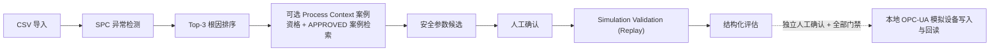
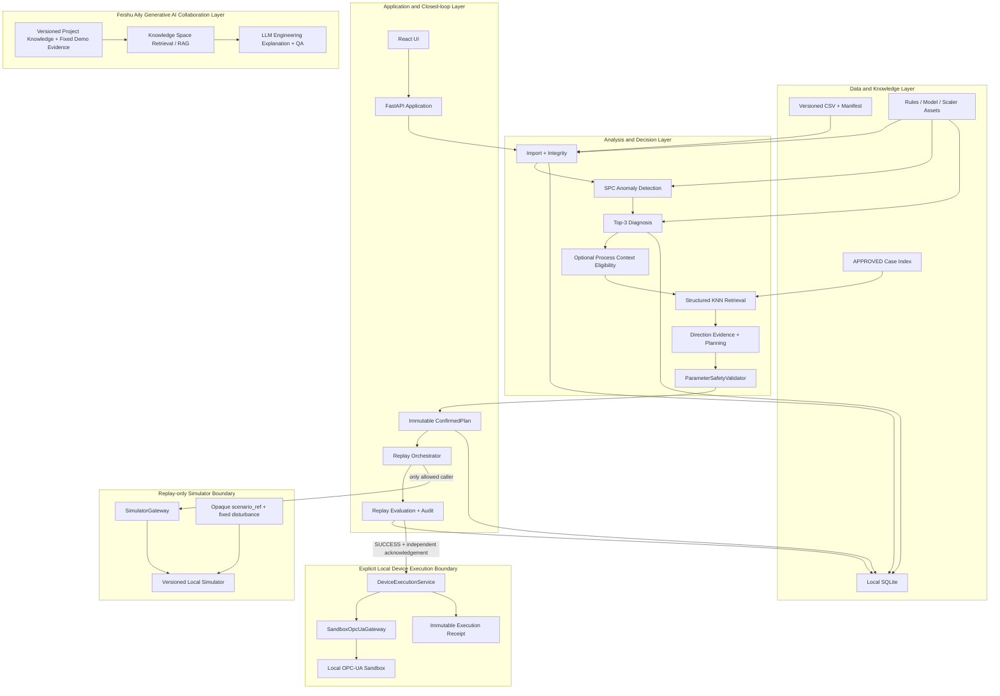

# TuneWise

**面向精密光学 Active Alignment（AA）工站的 Human-in-the-loop AI 调机决策支持原型**
*Offline AI-assisted tuning decision support for precision optical active-alignment workflows*

TuneWise 聚焦精密光学主动对准（AA）单一工站，通过离线数据导入、异常检测、根因排序、已审核案例检索、安全参数候选、人工确认和确定性模拟回放，为现场工程人员提供可追溯的调机决策支持。

- **参赛命题**：2026 AI 先锋未来人才大赛｜舜宇光学科技「智造调机助手」
- **当前状态**：`tw-08-complete` 基线上已完成复赛优先工程项 SF-01～SF-04；默认闭环仍止于结构化回放评估，显式 demo 模式可验证本地 OPC-UA 模拟设备受控下发，飞书 Aily V1 已发布并完成人工验收
- **快速入口**：[Quick Start](#快速启动) · [5 分钟演示](docs/submission/demo-script-5min.md) · [评委快速体验](docs/submission/judge-guide.md) · [Aily V1 验证](docs/validation/aily-v1-validation.md)
- **核心边界**：本项目是单工站、本地离线、人在回路的比赛原型，不是 AI 自动调机系统


> **规则约束模拟环境中的离线回放结果，不代表真实产线良率改善。**
>
> **当前 OPC-UA 通道连接的是本地模拟设备，不代表已经完成真实设备接入或真实设备安全验证。**

## 为什么做这个项目

精密装调中的数据、参数、质量结果与历史经验往往分散在不同载体中，异常排查容易依赖个人经验。反复试调不仅增加时间成本，也难以把一次成功处理转化为下一次可复用的知识。另一方面，直接让模型控制设备风险过高：证据可能不足，参数可能越界，历史案例也可能不适用于当前产品。

TuneWise 因此把问题限定为“决策支持”：AI 分析异常、进行根因排序、检索适用案例并形成参数候选与证据；工程师审核并选择/确认；之后才进入 Simulation Validation (Replay) / 执行前仿真验证和受控 sandbox 执行原型。

## 产品边界

- 只覆盖一个 AA 工站和一个代表性异常：中心 MTF 合格或临界合格、四角 MTF 不对称下降。
- 本地离线原型，运行期不依赖云服务、在线模型、API Key 或外部网络。
- 人在回路；系统给出候选，AA 工艺工程师确认后才允许模拟回放。
- 决策支持而非无人值守控制；未连接 MES、QMS 或真实设备。设备执行能力默认关闭，只能在显式 `OPCUA_SANDBOX` 模式下向本机模拟设备写入人工确认且回放成功的单参数方案。
- 数据来自公开知识与规则约束模拟，不使用舜宇真实产线数据，也不代表舜宇内部系统。
- 回放只验证固定版本模拟环境内的可复现变化，不证明真实因果关系、真实良率改善或参数最优性。

## 核心工作流



完整操作界面依次展示数据完整性、异常证据、诊断依据、案例距离、方向证据、安全检查、确认哈希、基线重现与回放结果，避免把闭环拆成无法追溯的孤立结果。

### 双层 AI 架构

TuneWise 引入飞书 Aily 构建生成式 AI 工程协作层。通过 Aily Knowledge Space、RAG 检索与大模型，将 TuneWise 的项目知识、算法规则、安全约束和固定运行证据组织为可交互的自然语言解释。

- **TuneWise Deterministic AI Core**：负责 SPC、feature engineering、root cause ranking、case retrieval、deterministic safety rules、parameter candidates、human confirmation、Replay 与受控 OPC-UA execution。
- **Feishu Aily Generative AI Collaboration Layer**：负责 Knowledge Space、RAG Retrieval、LLM、Engineering Explanation 与 Judge / Engineer QA。

Aily 不进入 TuneWise 的安全关键决策和设备控制链，不具备参数生成、`ConfirmedPlan` 创建或修改、Replay 触发、`SimulatorGateway`、`DeviceExecution` 或 OPC-UA 写权限。当前 V1 只使用版本化项目知识与固定 Demo Evidence，没有 Bridge、MCP 或 Runtime API，也不实时读取 TuneWise 运行状态。

## 核心能力

1. **版本化 CSV 与双哈希校验**：导入前同时校验原始文件 SHA-256 与规范化观测哈希，并绑定 schema、生成器、规则和模型版本。
2. **四类异常路由**：版本化 SPC 规则将批次路由为 `TARGET_ANOMALY`、`NORMAL`、`NON_TARGET_GLOBAL_DEGRADATION` 或 `INSUFFICIENT_DATA`，单点噪声不能触发主流程。
3. **Top-3 根因诊断**：固定 `StandardScaler` 与 multinomial logistic regression 对五类候选稳定排序；Z 类受额外硬门控。
4. **Logit 贡献解释**：展示“标准化特征值 × 当前类别模型系数”，只表示该特征对当前类别 logit 的贡献，不解释为真实故障概率或因果贡献。
5. **Process-aware 案例资格 + APPROVED-only 50-D KNN**：可选 Process Context 可基于当前阶段、previous action/outcome 与 iteration context 改变哪些兼容的已审核案例有资格提供 `CASE_GUIDED` 证据；有资格的案例仍使用现有 50-D 标准化欧氏距离排序。Process Context 不进入 classifier，也不直接计算参数值。
6. **参数方向证据**：每个参数独立记录当前值、标称值、建议方向、支持特征、支持规则与冲突状态；缺失或冲突时不进入候选。
7. **Decimal/tick 安全规则**：MVP v1 以 0.05 归一化原型单位为一个 tick，使用整数 tick 与 `Decimal` 避免二进制浮点边界问题和静默取整。
8. **统一 `ParameterSafetyValidator`**：范围、网格、单次最大变化、参数族、标称方向、跨标称值与方向证据由同一验证器校验。
9. **不可变 `ConfirmedPlan`**：人工确认后绑定候选 ID、候选哈希、身份、时间、规则和快照版本；前端不能覆盖服务端参数。
10. **STALE 与篡改阻断**：数据、诊断、参数、快照、规则或内容变化会使候选/确认方案失效；哈希或版本不一致时拒绝后续动作。
11. **Canonical baseline reproduction**：回放前先用同一 `ObservableCanonicalizer` 重现导入基线，规范化哈希一致才进入干预运行。
12. **Simulation Validation (Replay)**：基线与干预使用同一隐藏场景、样本数、扰动、seed 和因果版本，唯一变化是 `ConfirmedPlan` 参数；内部仍使用 Replay、`ReplayResult`、`/replays` 与 Replay Engine。
13. **结构化评估与审计链**：结果按冻结优先级判定为 `REGRESSION`、`SUCCESS`、`PARTIAL_IMPROVEMENT` 或 `NO_IMPROVEMENT`，保存版本、检查项与结果哈希。
14. **人工确认后的 OPC-UA 受控参数下发验证**：只接受服务端保存的 `ConfirmedPlan` 与 `ReplayResult=SUCCESS`，写前重跑 freshness/safety 并验证实际 server identity、mapping、datatype、unit、只读 access 与 Method capability。在 TuneWise 本地 OPC-UA sandbox 中，五个调机参数 Variable 对所有普通 OPC-UA 客户端永久只读；参数变化只能通过受控 `ApplyConfirmedParameterChange` Method，并在 sandbox 单一执行锁内完成 expected-before 比较、写入、回读和幂等记录。结果不确定时只读 reconciliation，绝不回退到普通 variable write。这是本地模拟设备提供的受控语义，不是 OPC-UA 协议天然提供 CAS，也不代表已验证真实 PLC 原子写或真实设备安全联锁。
15. **真实设备 shadow 数据契约与分析**：版本化 `ShadowEvidenceBundle` 绑定 raw/mapping/canonical measurement hash、context、reviewed outcome、provenance、unit mapping 与 review contract；独立 analysis contract 再绑定控制限、SPC、固定模型和安全资产。数据固定进入 `SHADOW_READ_ONLY`，不进入训练集、APPROVED 案例库或固定演示资产；无合法 review contract 时固定为 `NOT_EVALUABLE`，当前声明式审核只能标记 `EVALUATED_DECLARED_REVIEW`，不表示外部或专家验证。

## 系统架构



`SimulatorGateway` 只由 Replay 模块调用。异常检测、诊断、案例检索、方向证据、候选生成和安全校验均不能读取模拟器隐藏状态或通过试算寻找参数。

Process Context 只作用于案例资格与解释：它不改变 Engineering Feature Contract、`StandardScaler`、multiclass Logistic Regression、Root Cause labels、50-D case distance、`CONSERVATIVE` / `STANDARD`、`ParameterSafetyValidator`、Human Confirmation、`ConfirmedPlan`、Replay Engine、OPC-UA safety contract 或 Execution Receipt。当前 `ProcessContext` / `CaseProcessProfile` 来自 synthetic fixtures；相关状态名称是 TuneWise abstractions，不是行业标准状态或舜宇内部 SOP，compatibility rules 尚未经过真实企业过程数据验证。

`DeviceExecutionService` 是另一条独立边界，不扩展任务主状态机，也不由诊断、检索、规划、确认或 `SimulatorGateway` 调用。浏览器不能提交 endpoint、node id、参数名或参数值。

## 技术栈

| 层 | 当前实现 |
|---|---|
| 后端 | Python 3.11/3.12、FastAPI 0.128.8、Uvicorn 0.34.2、asyncua 1.1.8（仅显式本地 sandbox） |
| 前端 | React 19.2.5、TypeScript 7.0.2、Vite 8.1.4 |
| 数据存储 | Python `sqlite3`，本地 SQLite 文件位于忽略目录 `var/` |
| 机器学习与检索 | 固定 StandardScaler + multinomial logistic regression JSON 制品、纯 Python 推理、Decimal 结构化 KNN |
| 生成式 AI 工程协作 | 飞书 Aily Workflow Application、Knowledge Space Retrieval / RAG、Doubao-seed-2.0-Pro；独立发布，不进入 Core 运行时与控制链 |
| 测试 | pytest 9.0.2、Vitest 4.1.10、Testing Library 16.3.2、jsdom 29.1.1 |
| 本地离线部署 | FastAPI 同源托管已构建前端；loopback `127.0.0.1`；运行期无网络依赖 |

## 快速启动

### 环境要求

- Windows 10/11；
- Python `>=3.11,<3.13`；
- 仅在重建或测试前端时需要 Node.js 与 npm（本基线验证环境：Node 22.15.0、npm 10.9.2）。

仓库已提交运行所需的前端构建产物、演示 CSV、规则、模型、案例索引和模拟器资产。**安装完 Python 依赖后，启动和完整演示不需要联网。** 首次安装依赖通常需要访问 Python/npm 软件源，或使用预先准备的离线 wheel/npm 缓存；TW-13 的完整 Windows 离线发行包尚未实现。

### 安装并启动

```powershell
git clone https://github.com/gakialter/TuneWise.git
cd TuneWise
python -m venv .venv
.\.venv\Scripts\python.exe -m pip install -e ".[test]"
cmd /c ".venv\Scripts\activate.bat && start-tunewise.cmd"
```

浏览器访问：<http://127.0.0.1:8000>

`start-tunewise.cmd` 只绑定本机 loopback，设置 `PYTHONPATH` 后启动 FastAPI；首次运行会自动创建 `var/tunewise.db`。无需手工初始化数据库。

默认启动不会开启设备写入。需要演示本地 OPC-UA sandbox 时，显式运行：

```powershell
start-tunewise-opcua-demo.cmd
```

两个 OPC-UA 启动脚本都只使用仓库内 `%~dp0.venv\Scripts\python.exe`，不会回退到 PATH Python；缺少 `.venv` 时会给出安装命令并以非零退出。demo 入口先确认 4841/8000 未占用，再启动固定监听 `127.0.0.1:4841` 的 sandbox；sandbox 未就绪时 Web 应用不会继续启动，Web 应用退出或 Ctrl+C 时会清理子进程。也可用 `start-tunewise-opcua-sandbox.cmd` 单独启动模拟设备。不要把这两个入口用于真实设备。

### 验证版本化资产

```powershell
.\.venv\Scripts\python.exe -m pytest `
  tests/backend/test_public_assets.py `
  tests/backend/test_demo_asset_generation.py `
  tests/backend/test_diagnostic_assets.py `
  tests/backend/test_approved_case_asset_generation.py `
  tests/backend/test_parameter_planning_assets.py `
  tests/backend/test_replay_assets_and_gateway.py
```

这些测试会校验已提交资产、Manifest、版本和哈希。正常启动不需要重新生成资产，也不应修改 checked-in 资产。

### 运行完整测试

```powershell
.\.venv\Scripts\python.exe -m pytest
cd frontend
npm ci
npm test
```

### Production build

```powershell
cd frontend
npm ci
npm run build
```

构建产物写入 `src/tunewise/static/`，随后仍由 FastAPI 同源托管。更多逐步说明见[评委快速体验指南](docs/submission/judge-guide.md)，异常恢复见[演示应急卡](docs/submission/demo-recovery.md)。

## 五分钟演示

1. 点击“导入预置 AA 异常批次”，查看双哈希与 24 条观测校验。
2. 点击“运行异常检测”，查看目标异常、中心/四角 MTF 与持续性证据。
3. 点击“运行根因诊断”，查看 Top-3、规则和 logit 贡献；再点击“检索已审核案例”。
4. 点击“生成安全参数候选”，选择一个 `PASSED` 候选并点击“人工确认候选方案”。
5. 点击“运行离线模拟回放”，完成 Simulation Validation，查看 baseline reproduction、配对结果、评价检查与结果哈希。
6. 若使用 `start-tunewise-opcua-demo.cmd` 显式启用固定 loopback sandbox，再检查设备执行资格、完成独立人工 acknowledgement，并查看受控 Method 写入、readback 与 receipt；默认启动不包含这一步。

独立的 Process-aware Decision Demo 位于 <http://127.0.0.1:8000/process-aware-demo/>：它用相同 measurement evidence 与不同 synthetic Process Context 展示 eligible case 和 `CASE_GUIDED` 的确定性变化，不与 End-to-End Fixed Demo 拼成一个生产故事。

详细讲稿与时间分配见[5 分钟演示脚本](docs/submission/demo-script-5min.md)。

## 演示结果

以下结果来自固定版本、固定场景和固定扰动下的规则约束模拟回放。

| 指标 | Baseline | Intervention | 变化 |
|---|---:|---:|---:|
| Center MTF mean | 0.831003 | 0.832128 | +0.001125 |
| Worst corner MTF | 0.567683 | 0.651478 | +0.083795 |
| Corner range | 0.184837 | 0.102292 | -0.082545 |
| Corner std | 0.071709 | 0.042654 | -0.029055 |
| Control limit | false | true | 通过 |
| Target anomaly | true | false | 清除 |
| Replay status | — | `SUCCESS` | `attempt_count = 1` |

- Baseline reproduction：`PASSED`
- ReplayResult hash：`e639cf3f2e69e217338f0f7e96ecabfa45523ca7d92ab45a320eb2b3b1435350`


## 可信性与安全边界

- 模型不直接控制设备；仓库中没有真实设备写参接口。
- 前端只提交候选身份，不能覆盖服务端保存的建议参数。
- 所有候选必须通过唯一 `ParameterSafetyValidator`，案例引导也不能绕过。
- 只有人工确认并形成不可变 `ConfirmedPlan` 后才允许回放。
- `STALE` 候选和 `ConfirmedPlan` 不可确认或回放。
- 模拟器不参与诊断、检索或荐参，只在 Replay 边界内运行。
- 数据、规则、模型、索引、候选、确认与结果均绑定版本及 SHA-256 哈希。
- TuneWise Core 运行时的 LLM、外部网络 API 和真实设备调用均为 0；独立发布的 Aily 应用仅检索版本化知识与固定证据。
- Shadow 数据只有在显式 analysis contract 与当前冻结资产全部匹配后才允许运行离线分析；来源声明本身不会解锁诊断或安全候选。

## 项目验证

自动化工程验证的命令、结果和基线 commit 见 [`docs/validation/engineering-validation.md`](docs/validation/engineering-validation.md)。该文件记录的是绑定到 `1fdc526cc8794965b6c591a2fa5bc399e50a4e2b` 的历史快照，不冒充当前 HEAD 的全量测试结果。

飞书 Aily V1 的 Workflow、7 文件初始 Knowledge Pack、检索配置、安全 Hard Gates、Hero Demo 问答和 Published 状态见 [`docs/validation/aily-v1-validation.md`](docs/validation/aily-v1-validation.md)。当前仓库 Knowledge Pack 已增量扩展为 8 文件并加入 Process-aware evidence addendum；既有验收仍是此前 7 文件快照，不冒充新增文件已在外部 Aily 重新上传或重新验收。Aily 验收是在已发布应用中完成的人工 UI / conversational acceptance validation，不是自动化测试。

## 仓库结构

```text
TuneWise/
├─ assets/                 # 版本化演示、诊断、案例、规划和回放资产
├─ docs/                   # 规格、比赛背景与提交材料
│  ├─ images/              # 当前版本真实应用截图
│  ├─ aily/                # Aily 配置记录与 8 文件版本化 Knowledge Pack
│  └─ submission/          # 报名文案、评委指南、演示脚本与应急卡
├─ frontend/               # React / TypeScript 源码与前端测试
├─ src/tunewise/           # FastAPI、领域服务、SQLite 与静态前端
├─ tests/backend/          # 后端单元、集成、边界和资产测试
├─ tools/                  # 确定性资产生成器
├─ pyproject.toml
└─ start-tunewise.cmd      # Windows 本地启动入口
```

授权数据的只读适配与影子分析入口见 [`docs/real-device-shadow-data.md`](docs/real-device-shadow-data.md)。仓库中的 `synthetic-contract-*` 仅是自动化契约 fixture，不是真实设备数据。

## 局限性

- 尚未接入真实产线，未连接 MES、QMS 或真实设备；新增 OPC-UA endpoint 仅是本机模拟设备。
- 当前使用公开知识与规则化模拟数据，外部有效性尚未由真实生产数据验证。
- 正式冻结盲测评估留给 TW-11；本基线不把规格中的质量门槛宣称为已完成报告。
- 原 TW-09 的完整回放并发、拒绝、幂等和异常恢复仍未实现；本阶段的设备执行幂等与失败凭证是独立聚合，不等同于完成 TW-09。
- Windows 完整离线发行包留给 TW-13；当前源码启动仍需先准备依赖。
- 当前仅覆盖单一 AA 工站和一个代表性的四角 MTF 不对称异常。
- Process-aware Demo 使用 synthetic process context/profile；pitch `-3 / -4 ticks` 是 synthetic demonstration outputs，不证明真实推荐准确率、良率、production tuning effectiveness、causal effectiveness 或 sequential optimization。
- 任务关闭、复盘报告与新案例提交留给 TW-10；当前界面闭环止于 `REPLAYED`。
- Aily V1 仅基于版本化知识和固定 Demo Evidence 做 RAG 解释；没有 Bridge、MCP、Runtime API 或实时运行证据接入，也没有任何控制权限。

## 路线图

**已完成**

- TW-01：Windows 本地离线应用骨架；
- TW-02：版本化演示数据导入；
- TW-03：目标异常检测与保护路由；
- TW-04：Top-3 根因诊断与结构化解释；
- TW-05：APPROVED-only 相似案例检索；
- TW-06：安全参数候选与统一 Validator；
- TW-07：人工确认与不可变 `ConfirmedPlan`；
- TW-08：基线重现与确定性配对模拟回放。
- SF-01～SF-03：本地 OPC-UA sandbox 受控执行、shadow 数据适配与离线评估协议；
- SF-04：Feishu Aily RAG Engineering Copilot / fixed evidence explanation，已配置、发布并通过人工安全边界与 Hero Demo 验收。

**待完成**

- **复赛材料 SF-05**：见 [`docs/semifinal-engineering-roadmap.md`](docs/semifinal-engineering-roadmap.md)；在已冻结的 SF-01～SF-04 工程与验证事实基础上继续制作 PPT、答辩稿和视频。
- 以下原路线保持编号和历史含义，复赛优先阶段完成前暂缓执行：
- TW-09：回放拒绝、幂等、并发与异常恢复；
- TW-10：报告与待审核知识案例；
- TW-11：正式离线评估；
- TW-12：集成演示发布门；
- TW-13：Windows 离线发行。

## 免责声明

TuneWise 是基于公开资料与规则约束模拟数据构建的比赛原型，不代表舜宇真实内部系统，不使用舜宇真实产线数据，不提供真实设备控制或质量放行能力。页面中的模型分数仅用于候选排序，参数候选不是最优参数，配对模拟回放也不构成真实世界因果证明。

> **规则约束模拟环境中的离线回放结果，不代表真实产线良率改善。**
>
> **当前 OPC-UA 通道连接的是本地模拟设备，不代表已经完成真实设备接入或真实设备安全验证。**
