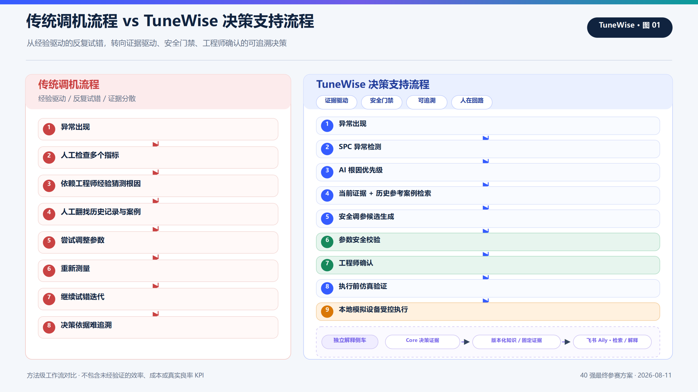
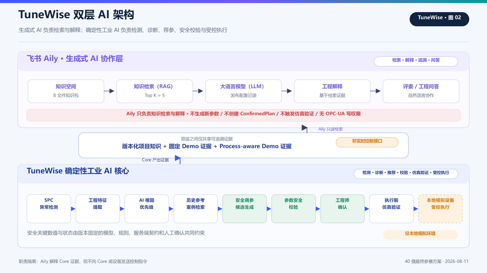
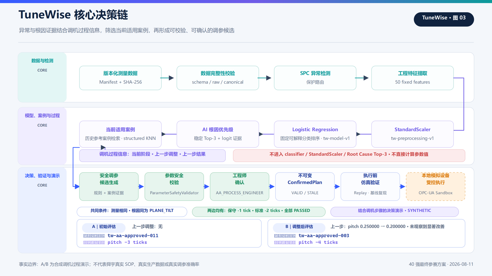
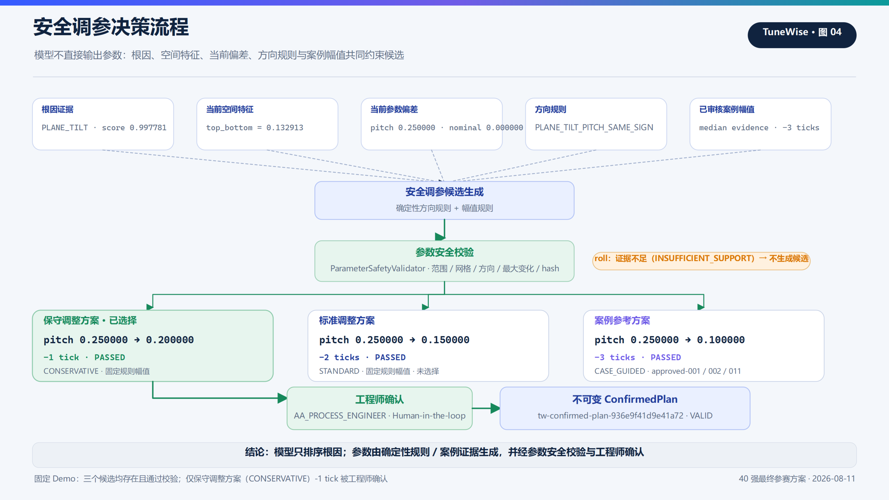
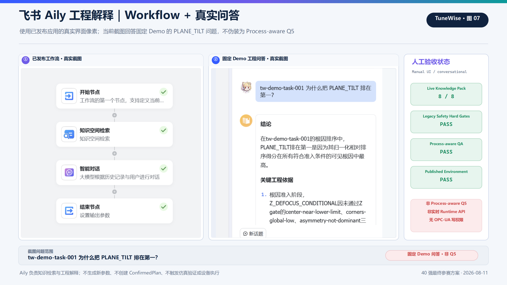
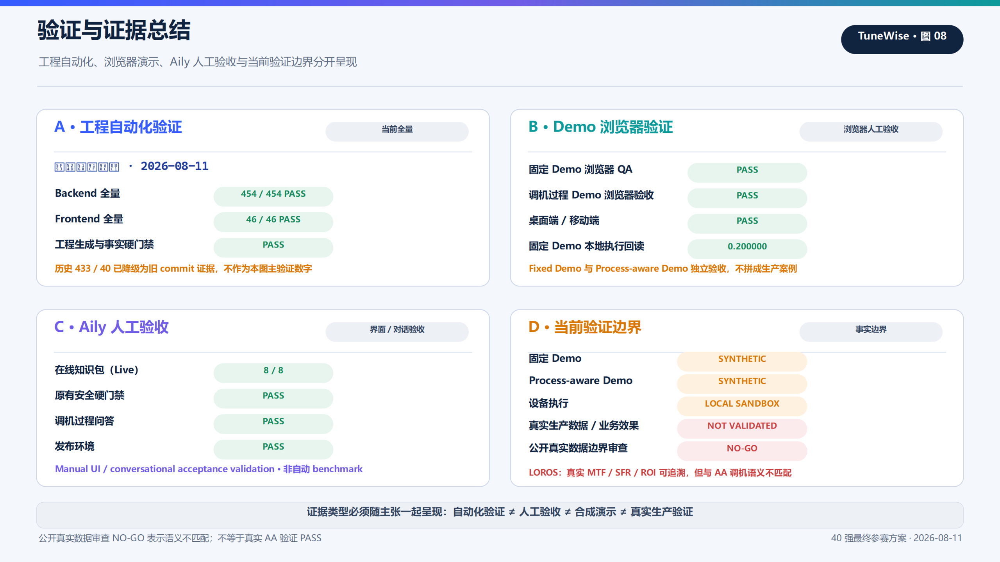

# 【40强赛】舜宇光学科技🤝工智跃迁｜TuneWise——AA 工站 AI 调机决策支持

> 本文基于 2026-08-11 Coach 反馈闭环后的当前仓库与验证证据形成，是最终飞书方案正文的内容与事实 source of truth。

## 一、参赛方案信息卡

| 项目 | 填写内容 |
|---|---|
| 企业 | 舜宇光学科技 |
| 队名 | 工智跃迁 |
| 参赛形式 | 个人参赛 |
| 成员 | 钟秉辰 |
| 命题 | 舜宇光学科技：如果你是智造专家，你将如何借助 AI 设计并打造「智造调机助手」，提升现场良率？ |
| 一句话摘要 | TuneWise 是面向精密光学 Active Alignment（AA）工站的 Human-in-the-loop AI 调机决策支持原型：AI 提供异常分析、根因优先级、历史参考案例和调参候选方案，工程师审核确认后再做执行前仿真验证与本地模拟设备受控执行。 |
| 成员介绍与分工 | 钟秉辰，个人参赛。独立负责场景研究、产品设计、确定性 AI 与安全链实现、飞书 Aily 知识与工作流配置、测试验证及提交材料编制。 |
| 使用的飞书 AI 能力 | **飞书 Aily**：Workflow Application、Knowledge Space、Knowledge Retrieval / RAG、LLM、Published Conversational Application。未使用妙搭、多维表格、MCP、Custom Connector、HTTP 或 Web SDK。 |

### 方案摘要

TuneWise 聚焦精密光学主动对准（Active Alignment，AA）单一工站。它不是让大模型自由生成参数或自动接管设备，而是把质量测量、当前参数、调机过程信息、平台状态与历史案例组织成一条可审计的决策链：版本化 CSV 导入后，系统用 SPC 识别目标异常，用固定工程特征与多分类逻辑回归排序五类根因；当前调机阶段、上一步调整和调整结果用于筛选当前适用的 `APPROVED` 合成开发案例；确定性方向、幅值和安全规则再生成少量调参候选。工程师确认后形成不可变 `ConfirmedPlan`，先做执行前仿真验证（Replay）；只有显式启用本地 OPC-UA sandbox、仿真验证为 `SUCCESS` 且全部门禁再次通过时，才允许演示单参数受控写入与回读。

在此基础上，已发布的飞书 Aily 应用承担生成式 AI 协作层：它检索 8 个版本化知识文件、固定 Demo 证据与 Process-aware Demo 证据，将复杂的模型、规则、安全边界和结果组织为自然语言解释。两层 AI 通过版本化知识和固定证据连接，而非实时控制接口。TuneWise 产生可验证的工业决策证据，飞书 Aily 负责检索、解释、追溯与问答。

---

## 二、方案成果展示

## 1. 命题场景、问题与痛点

### 1.1 为什么选择精密光学主动对准

主动对准需要同时观察中心与四角 MTF 等质量指标，并调整位置、倾角、焦向等多个参数。故障现象与根因并非一一对应：相似的四角下降可能来自平面倾斜、XY 偏心、平台不稳定、参考漂移或条件性 Z 离焦；同一参数变化又可能同时影响多个质量指标。因而，现场决策不能只看单个数值，更不能只凭一句自然语言建议直接下发参数。

本方案不把这些行业共性写成舜宇已确认的内部现状，也不虚构停线时长、试调次数或良率损失。它针对的是一类明确的方法问题：当信息分散、根因判断依赖经验、历史动作缺少适用条件、调参缺少统一约束时，工程师需要花费额外精力完成证据整理与风险判断，成功经验也难以安全复用。

### 1.2 传统工作流

```text
异常出现
  → 人工查看多个质量指标
  → 凭经验猜测根因
  → 手工翻找历史记录
  → 尝试调整参数
  → 再测并反复迭代
  → 结果与依据难以形成统一 provenance
```

这一流程有四个核心痛点：

1. **定位成本高**：质量、参数、设备状态和历史经验难以在同一上下文中查看。
2. **判断一致性不足**：不同人员对同一现象可能采用不同经验路径，结论难以复核。
3. **调参风险高**：参数越界、方向冲突、跨标称值或不适用案例都可能带来额外风险。
4. **知识沉淀弱**：如果没有版本、适用条件、确认记录和结果证据，“成功案例”可能在错误场景中被复用。

TuneWise 的切入点不是替代工程师，而是把“看什么、为什么、能否调整、谁确认、如何验证”变成一条结构化且可拒绝的链路。

### 图 1｜传统调机流程 vs TuneWise 决策支持流程



*图注：TuneWise 的核心变化不是移除工程师，而是把分散经验转成可核验的证据链，并在调参候选、工程师确认、仿真验证和执行之间设置安全门禁。该对比只描述工作流能力，不代表已验证的效率或良率提升。*

## 2. 方案优势与创新点

### 创新一：从“直接生成调参值”转向证据约束型决策

TuneWise 不允许模型直接给出可执行参数。根因排序只是起点；参数候选还必须同时具备根因证据、方向证据、可用案例证据、确定性幅值规则和 `ParameterSafetyValidator` 结果。缺少支持、方向冲突、版本过期或内容被篡改时，系统拒绝继续。这把 AI 的责任从“替人拍板”收敛为“帮助人形成可验证判断”。

### 创新二：安全关键 AI 与生成式 AI 解耦

底层 TuneWise 确定性工业 AI 核心负责数值分析、结构化检索、规则约束、工程师确认、执行前仿真验证和执行门禁；上层飞书 Aily · 生成式 AI 协作层负责检索、解释、追溯和问答。Aily 能解释为什么 `PLANE_TILT` 排在第一、为什么选择 pitch 减少 1 tick、仿真验证 `SUCCESS` 证明什么，却不能生成或修改参数、创建 `ConfirmedPlan`、触发仿真验证或写 OPC-UA。生成式 AI 的易用性与工业控制的确定性由此得到清晰隔离。

### 创新三：执行前仿真验证与设备门禁

新参数不会从模型输出直接流向设备。候选先经安全校验，再由工程师确认并冻结为不可变计划；执行前仿真验证先复现导入基线，随后在相同隐藏场景、扰动和 seed 下只改变确认参数。设备执行是独立边界，要求仿真验证 `SUCCESS`、独立人工确认和全部门禁再次通过。该设计强调“先证明当前模拟条件下一致可复现，再讨论受控执行”。

### 创新四：从数据到执行凭证的可追溯证据链

数据、规则、模型、Scaler、案例索引、调机过程信息、方向证据、候选、`ConfirmedPlan`、`ReplayResult` 与执行凭证都绑定版本或 SHA-256。对于写入开始后结果不确定的情况，系统进入 `UNKNOWN_OUTCOME`，只做同一幂等键下的只读核对，不盲目重写，也不根据当前值猜测成功。证据链不仅记录“做了什么”，还记录“为什么允许做、以什么版本做、结果是否可确定”。

## 3. 具体方案说明

### 3.1 双层 AI 总体架构

```text
飞书 Aily · 生成式 AI 协作层
知识空间 → 知识检索（RAG）→ 大语言模型（LLM）→ 工程解释 → 评委 / 工程问答
                           │
版本化项目知识 + 固定 Demo 证据 + Process-aware Demo 证据
                    （非实时控制接口）
                           │
TuneWise 确定性工业 AI 核心
SPC 异常检测 → 工程特征提取 → AI 根因优先级 → 历史参考案例检索
→ 安全调参候选生成 → 参数安全校验 → 工程师确认
→ 执行前仿真验证 → 本地模拟设备受控执行 → 执行凭证
```

当前两层之间的连接物是版本化项目知识、固定 Demo 证据和 Process-aware Demo 证据，不是实时控制接口。这样既能让评委与工程人员通过自然语言理解项目，又不让生成式回答进入安全关键决策和控制链。Aily 不生成新参数、不创建 `ConfirmedPlan`、不触发仿真验证，也无 OPC-UA 写权限。

### 图 2｜TuneWise 双层 AI 架构



*图注：双层架构以职责隔离换取工业可信度：Core 产生确定、可审计的决策证据，Aily 只读检索并解释这些证据。当前 V1 没有实时控制接口，Aily 不进入参数、确认、仿真验证或 OPC-UA 控制链。*

### 3.2 TuneWise 核心决策链

### 图 3｜TuneWise 核心决策链



*图注：TuneWise 的 AI 深度来自固定工程特征、可解释分类排序、调机过程信息驱动的案例资格、结构化案例检索与确定性安全规则，而不是让单一模型包办全部决策。调机过程信息位于案例检索环节，不进入分类器；最终动作仍受统一参数安全校验与工程师确认约束。*

#### 3.2.1 版本化数据导入

- **输入**：固定 schema 的 AA 批次 CSV、Dataset Manifest、规则和版本快照。
- **处理**：校验字段、原始文件 SHA-256 与规范化观测 SHA-256；固定 Demo 包含 24 条观测。
- **输出**：可追溯的 Measurement、参数快照与数据版本。
- **价值**：先证明“输入是什么、有没有变化”，避免后续结果脱离数据版本。
- **边界**：固定 Demo 是规则约束合成数据；哈希证明内容一致，不证明数据来自真实产线。

#### 3.2.2 SPC 异常检测

- **输入**：中心/四角 MTF 与只读控制限快照。
- **算法**：版本化 SPC 与持续性规则。
- **输出**：`TARGET_ANOMALY`、`NORMAL`、`NON_TARGET_GLOBAL_DEGRADATION` 或 `INSUFFICIENT_DATA`。
- **价值**：把目标异常与正常、整体退化、数据不足分开，保护后续诊断入口。
- **边界**：这是规则路由，不是模型对真实故障的最终确认；单点噪声不能触发主流程。

#### 3.2.3 固定工程特征

- **输入**：批次内 MTF、五个参数、振动、重复定位误差与标定残差。
- **处理**：形成 50 个固定批次工程特征，包括均值、标准差、趋势、最差角、四角极差、四角标准差及空间差异。
- **输出**：顺序固定、可哈希的特征向量。
- **价值**：把“看图凭感觉”变成可复算的结构化证据。
- **边界**：这些是原型特征，不是舜宇专有工艺变量或真实控制限。

#### 3.2.4 ML 根因排序

- **输入**：固定特征向量。
- **算法**：固定 `StandardScaler` 与 multinomial logistic regression，并配合显式规则和 Z 类硬门控。
- **输出**：五类候选中的稳定 Top-3、`normalized_score`、raw logit、主要 logit 贡献和证据充足度。
- **价值**：将多维观测压缩为可解释的排查优先级。
- **边界**：`normalized_score` 只用于当前候选根因的相对排序，不是经真实产线故障频率校准的概率；排序不证明真实因果关系。

当前固定五类根因为：`PLANE_TILT`、`XY_DECENTER`、`PLATFORM_INSTABILITY`、`REFERENCE_DRIFT`、`Z_DEFOCUS_CONDITIONAL`。其中并非所有类别都允许荐参；不可调或仅检查类结果不会绕过安全策略。

#### 3.2.5 历史参考案例检索与调机过程信息

- **输入**：当前任务重新计算并核对哈希的 50 维查询特征、产品与工站兼容条件，以及可选的调机过程信息：当前调机阶段、上一步调整、上一步调整结果。
- **算法**：调机过程信息先确定哪些已审核案例当前有资格参与；有资格的案例仍在独立 Scaler 下按 50 维标准化欧氏距离排序。
- **输出**：当前适用案例、距离、适用条件与历史动作证据，为案例参考方案提供 supporting evidence。
- **价值**：回答“现在这一步更适合参考哪个案例”，避免仅凭相似异常复制不适用于当前步骤的历史动作。
- **边界**：调机过程信息不进入 Logistic Regression classifier，不修改 `StandardScaler`，不改变 Root Cause Top-3 算法，也不直接计算参数值。索引中的 60 个 `APPROVED` 案例来自 synthetic development training partition；`APPROVED` 只是项目内准入状态，不代表专家真值或真实生产验证。

##### 结合调机步骤的决策演示

**异常判断相同，调机过程不同，适用的参考案例也会不同。** 这是资产 `tw-process-aware-demo-v1` 提供的独立合成 fixture，与 `tw-demo-task-001` 固定端到端 Demo 严格分离。

共同条件：测量数据相同，根因优先级相同，Top-1 均为 `PLANE_TILT`。

| 场景 | 调机过程信息 | 当前适用案例 | 案例参考方案 |
|---|---|---|---|
| A｜初始评估 | 上一步调整：无 | `tw-aa-approved-011` | pitch `-3 ticks` |
| B｜调整后评估 | 上一步 pitch `0.250000 → 0.200000`；结果：未观察到显著改善 | `tw-aa-approved-003` | pitch `-4 ticks` |

两边的保守调整方案均为 `-1 tick`，标准调整方案均为 `-2 ticks`，参数安全校验全部 `PASSED`。这说明变化首先发生在“当前适用案例 → 案例参考方案”这条证据支路，未改变分类器、保守 / 标准规则或安全校验。

> **事实边界：**这是合成调机过程演示，用于证明不同调机过程信息可以确定性地改变历史案例资格。不代表舜宇真实 SOP，也不证明真实生产调参准确率、真实效果或因果关系。

#### 3.2.6 安全调参候选

- **输入**：Top-1 根因、当前值、标称值、空间特征、兼容案例和冻结规则。
- **算法**：确定性方向规则；保守调整方案（`CONSERVATIVE`）固定 1 tick、标准调整方案（`STANDARD`）固定 2 ticks，以及受当前适用案例中位数约束的案例参考方案（`CASE_GUIDED`）。
- **输出**：最多三组带方向、幅值、证据来源和哈希的只读候选。
- **价值**：让工程师同时看见“改哪个参数、往哪改、改多少、依据是什么”。
- **边界**：候选是受约束方案，不是最优参数；LLM 与 Aily 不参与方向或幅值计算。

#### 3.2.7 参数安全校验（ParameterSafetyValidator）

- **输入**：候选、参数约束快照、方向证据和当前诊断上下文。
- **校验**：合法范围、0.05 tick 网格、非零变化、最大单次变化、参数数量与参数族、Top-1 允许族、方向一致、减少标称偏差、不跨标称值、版本绑定与候选哈希。
- **输出**：`PASSED` 或结构化拒绝原因。
- **价值**：所有生成路径共用一个服务端权威验证器，案例引导也不能绕过。
- **边界**：通过规则校验只表示满足当前原型约束，不等于真实设备或工艺放行。

#### 3.2.8 工程师确认与不可变 ConfirmedPlan

- **输入**：工程师选择的 `PASSED` 候选身份。
- **处理**：服务端重新读取候选、复核安全与哈希，绑定 actor、时间、数据、模型、规则和快照版本。
- **输出**：状态为 `VALID` 的不可变 `ConfirmedPlan`。
- **价值**：把“模型建议”与“人类授权”明确分开，并为执行前仿真验证与执行提供唯一权威计划。
- **边界**：前端不能覆盖参数；上游数据、诊断、规则、参数或内容变化会使计划 `STALE`；人工确认不等于质量放行。

### 图 4｜安全调参决策流程



*图注：固定 Demo 证明“模型排序根因”和“系统生成参数候选”是两件不同的事；保守、标准与案例参考三类候选均通过统一安全校验，最终由工程师（内部身份 `AA_PROCESS_ENGINEER`）选择最保守的 -1 tick 方案。证据不足的 roll 轴不会生成候选。*

#### 3.2.9 执行前仿真验证

- **输入**：服务端保存的 `ConfirmedPlan` 与固定模拟资产。
- **处理**：先用同一 canonicalizer 重现导入基线；哈希一致后，在相同场景、样本数、扰动、seed 和因果版本下运行 baseline 与 intervention，唯一变化是确认参数。
- **输出**：仿真验证结果 `REGRESSION`、`SUCCESS`、`PARTIAL_IMPROVEMENT` 或 `NO_IMPROVEMENT`，以及指标、检查项和结果哈希。
- **价值**：用配对模拟检查候选在当前固定环境中是否满足评价规则，并保留可复算证据。
- **边界**：“仿真验证通过”只表示当前固定 simulator、seed、disturbance 和评价规则下，确认方案满足预设条件；不代表真实设备有效、良率提升、最优参数、生产收益或真实因果证明。

#### 3.2.10 本地 OPC-UA 受控执行

- **输入**：独立工程师确认、fresh 且 `VALID` 的 `ConfirmedPlan`、绑定的 `ReplayResult`。
- **门禁**：设备执行默认关闭；仅显式 `OPCUA_SANDBOX` 模式可用；执行前核对仿真验证 `SUCCESS`、基线复现、安全验证、单参数限制、server identity、mapping、datatype、unit、access、Method capability 与设备健康。
- **执行**：五个参数 Variable 对普通客户端永久只读；唯一运行期变更入口是 `ApplyConfirmedParameterChange` Method。Method 在 sandbox 单一执行锁内完成幂等查询、权威值读取、expected-before 比较、写入、readback 和设备记录。
- **输出**：不可变 execution receipt；状态包括 `SUCCEEDED`、明确拒绝/失败、`UNKNOWN_OUTCOME` 与 `RECONCILIATION_REQUIRED`。
- **价值**：演示“分析建议”如何在严格门禁后转化为可审计的单参数受控动作。
- **边界**：这只证明 loopback 本地模拟设备的受控语义，不证明 OPC-UA 天然提供 CAS，不代表真实 PLC 原子写、真实设备安全联锁、生产证书身份或现场安全认证；当前不支持多参数执行和自动回滚。

### 图 5｜Fixed Demo 真实运行界面


*图注：图中三个页面来自当前脚本实际运行 `tw-demo-task-001` 后的诊断 / 候选、ConfirmedPlan / 仿真验证和本地设备执行回执界面。小标签保留参数安全校验、工程师确认、基线复现、仿真通过后再检查设备执行资格与仅本地 sandbox 等门禁。软件实际运行不等于真实产线、真实设备或生产效果验证；完整安全语义仍以 3.2.9–3.2.10 正文为准。*

### 图 6｜结合调机步骤的决策演示


*图注：图中是 `/process-aware-demo/` 的实际 A/B 运行界面：shared evidence 相同，A / B 的调机过程信息不同，当前适用案例与案例参考方案随之改变，保守 / 标准方案和安全校验保持不变。界面真实运行，但输入仍是 `SYNTHETIC_TEST_FIXTURE`；不代表舜宇 SOP、真实生产调参准确率或生产验证。*

### 3.3 飞书 Aily 工程解释与问答

#### 为什么需要 Aily

TuneWise Core 的输出包含模型版本、规则、哈希、候选状态、仿真验证检查和设备凭证。它们对工程审计很重要，却不适合每位评委或现场人员直接阅读。Aily 的价值不是替代 Core，而是把分散在项目文档、规则、固定 Demo 与 Process-aware Demo 证据中的事实变成可对话的解释入口。

#### 当前已发布实现

- Application：`TuneWise`
- Workflow：`TuneWise Engineering Copilot`
- Knowledge Space：`TuneWise Engineering Knowledge`
- 工作流：`Start → Knowledge Space Retrieval → LLM → End`
- 知识包：8/8 个版本化 UTF-8 文件
- Retrieval：Top K = 5；Threshold Filter = off
- 发布时 LLM：`Doubao-seed-2.0-Pro`
- 状态：Published Conversational Application

#### Aily 的输入、处理与输出

- **输入**：用户问题、知识空间检索到的版本化项目知识、固定 Demo 证据与 Process-aware Demo 证据。
- **AI 处理**：RAG 检索后由 LLM 组织回答；系统提示要求证据不足时明确拒绝猜测。
- **输出**：项目概览、根因排序解释、参数方向与幅值解释、调机过程信息影响、仿真验证语义、安全边界和评委 / 工程问答。
- **价值**：降低工程证据的理解成本，让同一套事实边界可以被检索、解释和追溯。
- **边界**：当前没有实时 Evidence Bridge、Runtime API 或设备工具调用；Aily 不读取 Core 实时状态，不生成或修改参数，不创建或修改 `ConfirmedPlan`，不触发仿真验证、`DeviceExecution` 或 OPC-UA 写入。

#### 已完成的人工验收

Aily V1 已在发布应用中完成 **Manual UI / conversational acceptance validation**：

- Live Knowledge Pack：8/8。
- Legacy Safety Hard Gates：PASS。
- Process-aware QA：PASS，能解释同一根因下不同调机过程信息为何对应不同当前适用案例与案例参考方案。
- Published Environment：PASS。

这些是人工验收记录，不是 automated benchmark、100% model accuracy 或 real production validation。仓库已纳入参赛者人工核验的真实 Aily 固定 Demo Hero QA 截图 `assets/40-final/aily-screenshots/03_hero_qa.png`；最终图 7 只嵌入这张既有截图，不生成或补写 Aily 对话。

### 图 7｜飞书 Aily 工程解释｜Workflow + 真实问答



*图注：左侧展示 Aily Workflow 与 8 文件知识包；右侧只嵌入仓库既有真实截图，其问题是“`tw-demo-task-001` 为什么把 `PLANE_TILT` 排在第一？”，属于固定 Demo Hero QA，明确不是 Process-aware Manual Acceptance 的 Q5。Process-aware QA PASS 来自人工验收记录，不伪造 Q5 截图。Aily 只负责检索与解释，无参数生成、确认、仿真验证或 OPC-UA 写权限；真实 UI 也不等于模型准确率或生产验证。*

## 4. 固定 Demo：一条完整而有边界的证据链

固定 Demo 身份为 Task `tw-demo-task-001`，预置资产 `tw-aa-demo-v1`，数据域为规则约束 synthetic AA prototype data，共 24 条观测。图 5 展示软件实际运行界面；下表继续作为固定 Demo 精确事实源。本节不与独立的合成调机过程 A/B 演示拼接为“真实生产案例”。

| 环节 | 固定证据 | 说明边界 |
|---|---|---|
| 异常检测 | `TARGET_ANOMALY`；24/24 持续违反路由信号 | 版本化 SPC 结果，不是真实产线故障结论 |
| 根因优先级 | Top-1 `PLANE_TILT`，`normalized_score=0.997781` | 相对排序分数，不是 99.7781% 故障概率 |
| Top-3 | `PLANE_TILT` → `XY_DECENTER` → `REFERENCE_DRIFT` | 根因候选优先级，不证明真实因果 |
| 历史参考案例 | 3 个兼容 `APPROVED` PLANE_TILT cases | synthetic development cases，不是企业内部案例 |
| 调参候选 | pitch `0.250000 → 0.200000`，保守调整方案（`CONSERVATIVE`），`-1 tick` | 确定性规则候选，不是最优参数 |
| 参数安全校验 | Candidate `PASSED`；pitch `NO_CONFLICT`，roll `INSUFFICIENT_SUPPORT` | 因此只选择有证据的 pitch 单轴变化 |
| 工程师确认 | `AA_PROCESS_ENGINEER` 人工选择；ConfirmedPlan `VALID` | 固定演示身份，不映射真实企业授权体系 |
| 执行前仿真验证 | 基线复现 `PASSED`；仿真验证 `SUCCESS`；attempt `1` | 只属于固定版本确定性模拟环境 |
| 本地模拟设备执行 | `LOCAL_OPCUA_SANDBOX`；execution `SUCCEEDED`；回读 `0.200000` | 本地 loopback 模拟设备，不是真实设备 |
| 工程解释 | Aily 可解释根因、候选与仿真验证边界 | 固定 evidence RAG，不是实时控制连接 |

仿真验证中的固定 baseline → intervention 如下：

| 模拟指标 | Baseline | Intervention | 变化 |
|---|---:|---:|---:|
| Center MTF mean | 0.831003 | 0.832128 | +0.001125 |
| Worst corner MTF | 0.567683 | 0.651478 | +0.083795 |
| Corner range | 0.184837 | 0.102292 | -0.082545 |
| Corner std | 0.071709 | 0.042654 | -0.029055 |
| Control limit pass | false | true | 通过 |
| Target anomaly triggered | true | false | 清除 |

> 以上变化来自固定 `tw-simulator-v1`、固定场景、固定扰动、固定 seed 与 `tw-evaluation-v1`。“仿真验证通过”只表示当前固定条件与评价规则下满足预设条件，不代表真实设备有效、良率提升、最优参数、生产收益或真实因果证明。

## 5. 调机流程对比

| 传统流程：经验与信息分散 | TuneWise：决策支持证据闭环 |
|---|---|
| 人工逐项查看质量与参数 | 版本化数据与完整性校验 |
| 凭经验猜测根因 | SPC 路由 + Top-3 根因与 logit 证据 |
| 手工翻找历史记录 | 兼容、`APPROVED`-only 的结构化案例检索 |
| 直接尝试参数 | 方向证据 + 确定性幅值 + Safety Validator |
| 调整依据不统一 | 人工确认并冻结不可变 ConfirmedPlan |
| 再测结果难复现 | 基线复现 + 配对执行前仿真验证 |
| 执行失败语义模糊 | 单参数 Method、幂等、readback、receipt、reconciliation |
| 工程证据阅读门槛高 | 飞书 Aily 基于固定知识与证据进行自然语言解释 |

该对比描述的是工作流能力，不是企业实测 KPI。当前不能给出效率提升百分比、成本节省金额或真实良率变化；这些需要在授权数据和现场协议下另行验证。

## 6. 方案价值

### 6.1 工程效率：减少证据整理路径

TuneWise 把异常指标、根因候选、案例、参数依据、安全检查、确认和结果放在同一任务中。预期可减少工程师跨载体查找和重复整理信息的步骤，使讨论围绕同一版本证据展开。Aily 进一步把这些证据转化为可检索的自然语言解释。实际节省时间仍需在企业 Shadow Mode 中测量。

### 6.2 调机安全：让“不能继续”成为系统能力

方案的重点不仅是给建议，更是结构化拒绝：数据不足、不可调根因、方向冲突、越界、离网格、跨标称、计划过期、仿真验证不通过、设备身份或能力不匹配都会阻断后续。设备执行默认关闭，当前仅验证本地 sandbox 单参数路径。它不能替代真实设备的 PLC 联锁、证书、审批和现场安全制度。

### 6.3 知识沉淀：保存证据，而非只保存结论

可复用知识应包含异常现象、数据版本、模型与规则、根因排序、调机过程信息、候选依据、确认主体、仿真验证结果和适用条件。当前 `APPROVED` 案例库与调机过程资料均为固定 synthetic development assets，尚未实现把真实任务自动写回生产知识库；但其准入隔离与版本化结构证明了“知识必须先审核再复用”的方法。

### 6.4 可复制性：将场景知识与安全骨架分开

根因、特征、方向规则和约束属于具体工艺；版本、哈希、确认、执行前仿真验证、幂等、receipt 与事实边界属于可复用安全骨架。迁移时可以替换场景资产，同时保留证据链与执行门禁思路，降低把一个 Demo 生硬复制到另一设备的风险。

## 7. 已验证工程指标与待验证业务价值

### 已验证或已记录的工程证据

- 当前后端全量：**454 / 454 PASS**。
- 当前前端全量：**46 / 46 PASS**。
- 固定 Demo：24 条观测，完整“检测 → 诊断 → 推荐 → 校验 → 工程师确认 → 仿真验证 → 本地模拟执行 → 解释”演示链；实际软件运行界面与浏览器 QA PASS。
- Process-aware Demo：相同异常证据、不同调机过程信息的实际 A/B 界面与浏览器 QA PASS；桌面 / 移动端 PASS；输入仍为合成 fixture。
- 五类固定根因、50 个固定工程特征、60 个 `APPROVED` synthetic development cases。
- Aily 人工验收：Knowledge Pack 8 / 8、Legacy Safety Hard Gates PASS、Process-aware QA PASS、Published Environment PASS。
- 历史自动化快照 `1fdc526` 的 433 backend / 40 frontend 仅作为旧 commit 证据保留，不再作为主验证数字。

### 图 8｜验证与证据总结



*图注：验证摘要分开呈现工程自动化验证、固定 / Process-aware Demo 浏览器验证、Aily 人工验收与当前验证边界。当前主数字为 backend 454/454、frontend 46/46；固定与 Process-aware Demo 均为 synthetic，本地设备为 sandbox；公开真实数据审查为 NO-GO，不是验证 PASS。*

“实际软件运行界面”只证明当前本地软件按记录运行，不把 synthetic Demo、本地 sandbox 或 Aily UI 升格为真实产线、真实设备、真实数据或生产效果验证。

### 公开真实数据验证边界审查

按照 Coach 建议，我们进一步核验了 Rikkyo University 的 LOROS 公开真实光学实验数据。LOROS 提供真实采集的 slanted-edge MTF / SFR / processed ROI 数据，provenance 和 `CC-BY-4.0` 许可可追溯；当前 record DOI 为 `10.5281/zenodo.17493261`，配套论文 DOI 为 `10.1186/s40645-025-00783-7`。

但 LOROS 缺少 AA production identity、x/y/z/pitch/roll 设备状态、调机动作、root-cause ground truth、参数方向、before/after intervention、process stage 与 production outcome。语义映射审查结论因此是 **NO-GO**：为避免制造虚假的生产验证，TuneWise 未强行将其接入现有诊断和荐参模型，也没有伪造 `PLANE_TILT` ground truth、把 edge angle 当 pitch、把 `Pos 0..5` 当空间五点、把 wavelength 当参数、复制中心 MTF 到四角或修改 frozen classifier contract。真实 AA 业务效果继续保留至授权企业数据验证阶段。

### 待真实环境验证的价值

- 异常定位信息整理时间是否下降；
- 人工查找案例与规则的步骤是否减少；
- 不合规候选在真实工艺约束下的拦截效果；
- 工程师对根因证据与 Aily 解释的接受度；
- 在授权 shadow 数据上的 Top-1/Top-3 reviewed-label consistency；
- 在独立现场协议下的真实质量、节拍与成本影响。

在取得这些数据前，本方案不填写收益百分比、金额或真实良率提升。

## 8. 可落地性与成熟度

### 当前已经完成

- 可运行的本地 software prototype；
- 版本化数据、SPC、固定 ML 根因排序与结构化解释；
- APPROVED-only 检索、安全参数候选与统一 Validator；
- 人工确认、不可变 ConfirmedPlan、STALE 保护；
- 基线复现与确定性配对执行前仿真验证；
- 默认关闭的本地 OPC-UA sandbox 单参数受控执行、readback、receipt 与恢复语义；
- Shadow Data 映射、来源、review 与分析契约的只读隔离；
- 已发布并完成 8/8 Knowledge Pack、Legacy Safety Hard Gates 与 Process-aware QA 人工验收的飞书 Aily 工程解释应用；
- 调机过程信息驱动的当前适用案例与案例参考方案演示；
- LOROS 公开真实光学数据语义边界审查（NO-GO）；
- 自动化工程验证记录、浏览器证据与版本化知识包。

### 当前尚未完成

- 舜宇或其他真实光学产线接入；
- 经授权真实设备数据的外部验证；
- 真实 PLC、设备联锁、生产证书与身份环境；
- 企业 MES/QMS 集成；
- 真实工艺控制限与物理单位映射审批；
- 生产级多用户、质量放行、多参数原子执行或自动回滚；
- 经真实业务数据验证的效率、成本与良率收益。

### 三阶段落地路线

**Phase 1｜Shadow Mode**

取得授权导出数据，由设备、工艺与数据责任方确认字段语义、单位、设备型号、batch/lot、来源与授权引用。数据只进入 `SHADOW_READ_ONLY`，先做完整性、质量和离线输出评估，不进入训练集、案例库或设备写入。

**Phase 2｜Engineer Decision Support**

在真实工程师监督下对诊断证据、候选合法性和解释质量做盲评或回顾性验证；建立真实的审核协议、拒绝标准和版本管理。系统仍只提供决策支持，由工程师在企业既有流程中执行。

**Phase 3｜Supervised Controlled Execution**

只有在设备侧受控 Method/CAS 或 PLC/上位机联锁、身份与证书、审批、回滚、并发所有权、断线恢复和现场安全测试全部获批后，才讨论受监督的真实设备集成。当前项目没有到达此阶段，更不以无人值守自动调机为近期目标。

## 9. 可推广性

TuneWise 的优先推广对象不是“所有工业场景”，而是同时满足以下条件的设备调优或工艺调参问题：

- 存在多参数耦合，但参数空间可以明确约束；
- 过程指标可测量并可形成版本化数据；
- 根因候选能够结构化，且可区分可调与仅检查类别；
- 历史案例有明确适用条件和审核状态；
- 高风险动作必须保留人工确认；
- 结果可以先在离线、shadow 或仿真环境中评估。

在这些条件下，方法可优先评估迁移到光学 AA、精密装调及部分参数型工艺优化场景。每次迁移都必须重新建立真实特征、控制限、单位、规则、模型、案例准入与设备安全协议，不能直接复用当前 synthetic 参数。

## 10. 体验入口与 Demo 状态

- GitHub 工程证据：<https://github.com/gakialter/TuneWise>
- 本地体验：按仓库 README 在 Windows 环境启动，浏览器访问 `http://127.0.0.1:8000`；该地址只在运行者本机有效，不是互联网体验链接。
- Process-aware 本地演示：`http://127.0.0.1:8000/process-aware-demo/`；它是独立合成 A/B Demo，不与固定端到端 Demo 拼接。
- 飞书 Aily：应用已发布，但当前仓库与报名材料没有可公开核实的访问 URL；如提交时允许公开体验，由参赛者人工粘贴真实链接并验证权限。
- Demo 视频：本轮未制作；官方模板将其列为建议项而非必须项。

不得为填满模板虚构在线体验地址、二维码、测试账号或视频链接。

---

## 三、自由展示区

### 1. 安全执行的关键设计

TuneWise 把设备执行做成独立边界，而非主流程的默认终点。浏览器不能提交 endpoint、node id、参数名或参数值；服务端从不可变计划读取唯一动作。执行开始前重跑计划有效性、仿真验证与参数安全校验门禁；设备侧 Method 再执行幂等查询、expected-before 比较、单参数写入和 readback。相同 idempotency key 返回首个设备记录，不产生第二次物理写入。

如果写入开始后通信中断，系统不会把它简化为“失败并重试”，而是记录 `UNKNOWN_OUTCOME`。恢复过程只使用同一 key 查询设备侧证据；没有可信记录时保持 `RECONCILIATION_REQUIRED`，即使当前值恰好等于目标也不伪造 `SUCCEEDED`。这是 TuneWise 对工业系统“不确定结果”问题的明确建模。

### 2. Shadow Data 的诚实边界

Shadow 模块区分 `SYNTHETIC_DEMO`、`CONTRACT_FIXTURE` 与 `REAL_DEVICE_SHADOW_DECLARED`。最后一项只表示操作者声明，不表示 TuneWise 已验证来源、授权或真实性。当前仓库仅有 synthetic contract fixture；没有经授权的真实光学设备数据。所有 Shadow 数据固定进入只读隔离，不会自动训练模型、进入 `APPROVED` 案例库或修改演示资产。无合法 review contract 时，评估状态固定为 `NOT_EVALUABLE`。

### 3. 工程证据与事实治理

项目用冻结版本、canonical JSON、SHA-256、不可变对象和测试把“事实边界”落到实现，而不只写在免责声明中。现有验证记录明确区分当前全量测试、旧 commit 历史快照、浏览器人工 QA 与 Aily 人工会话验收；也明确区分固定 synthetic Demo、Process-aware synthetic Demo、声明式 shadow 与公开真实数据语义边界审查。历史 `Cobalt_v2.pdf` 是实现前材料，不作为本次最终事实源。

### 4. Coach 反馈闭环

- **“Replay 看不懂”**：评委向统一改为“执行前仿真验证”；完整门禁保留在 3.2.9–3.2.10 正文与图 3 / 4，图 5 以运行界面小标签提示“基线复现 → 仿真通过 → 设备资格检查”，并明确只属于固定模拟条件。
- **“缺少调机步骤”**：已实现并展示“当前异常证据 + 调机过程信息 → 当前适用案例 → 案例参考方案”的合成 A/B 演示；分类器、Scaler 和 Root Cause Top-3 不变。
- **“没有企业数据就核验公开数据”**：完成 LOROS 一手来源与字段语义审查，结论为 NO-GO；没有为了比赛制造虚假的 AA 生产验证。

---

## 四、附录：关键证据索引与声明

### 关键证据索引

- 参赛命题与报名边界：[`docs/competition/challenge-brief.md`](../competition/challenge-brief.md)
- 当前项目定位与工程边界：[`README.md`](../../README.md)
- 固定 Demo Evidence：[`docs/aily/knowledge/05_demo_evidence_snapshot.txt`](../aily/knowledge/05_demo_evidence_snapshot.txt)
- 飞书 Aily V1 人工验收：[`docs/validation/aily-v1-validation.md`](../validation/aily-v1-validation.md)
- 自动化、浏览器与 OPC-UA 证据：[`docs/validation/engineering-validation.md`](../validation/engineering-validation.md)
- 图 5 / 6 实际运行截图 provenance：[`runtime-screenshot-evidence.json`](assets/40-final/runtime-screenshots/runtime-screenshot-evidence.json) 与 [`runtime-screenshot-manifest.sha256`](assets/40-final/runtime-screenshots/runtime-screenshot-manifest.sha256)
- 调机过程信息 Demo 固定资产：[`assets/demo/tw-process-aware-demo-v1/process-aware-demo.json`](../../assets/demo/tw-process-aware-demo-v1/process-aware-demo.json)
- 图 7 既有真实 Aily 固定 Demo 问答：[`03_hero_qa.png`](assets/40-final/aily-screenshots/03_hero_qa.png)
- LOROS 公开真实数据边界审查：[`docs/research/loros-public-optical-dataset.md`](../research/loros-public-optical-dataset.md)
- Shadow Data 契约：[`docs/real-device-shadow-data.md`](../real-device-shadow-data.md)
- OPC-UA 控制工程边界：[`docs/control-engineering-handoff.md`](../control-engineering-handoff.md)
- 本次主张矩阵：[`docs/submission/40-final-evidence-matrix.md`](40-final-evidence-matrix.md)

### 必须保留的事实声明

1. TuneWise 是比赛原型，不代表舜宇真实内部系统。
2. 固定 Demo、模型开发资产与 `APPROVED` 案例为公开知识和规则约束的 synthetic data，不是企业真实生产数据。
3. `normalized_score` 只用于根因相对排序，不是校准后的真实故障概率或真实发生率。
4. “仿真验证通过”只表示当前固定 simulator、seed、disturbance 和评价规则下满足预设条件，不证明真实良率、生产收益、真实设备效果、因果关系或参数最优。
5. 当前 OPC-UA 通道只连接本地 loopback sandbox，不代表真实 PLC/设备接入或生产安全认证。
6. Aily 只检索和解释版本化知识与固定证据，不生成参数、不修改 ConfirmedPlan、不触发仿真验证或设备写入。
7. Process-aware Demo 使用合成调机过程与案例条件，不代表舜宇真实 SOP 或真实生产调参准确率；它与固定 Demo 严格分离。
8. LOROS 只用于公开真实光学数据的语义边界审查，NO-GO 不等于真实 AA 验证 PASS。

> 执行前仿真验证结果只属于固定模拟条件，不代表真实设备效果、真实产线良率改善或生产收益。
